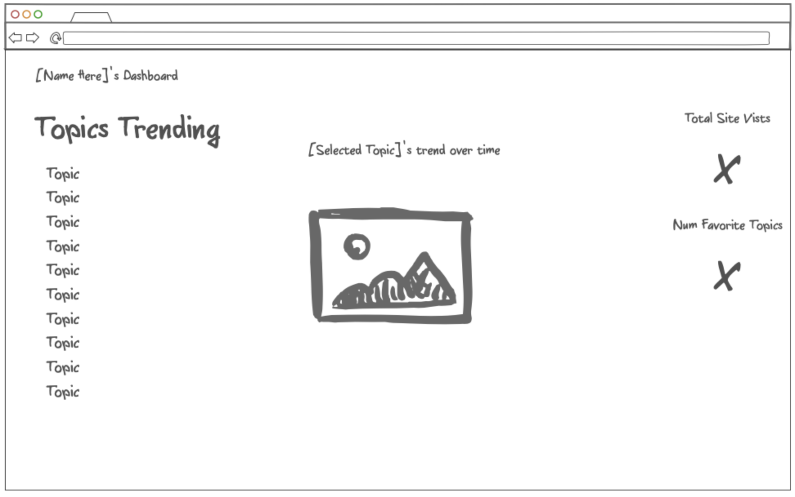

# startup of Landon Fackrell
# Merge Conflict Homework
I can't seem to figure out how to get it to give me a merge conflict with the instructions we were given.. I seem to follow them exactly and I just keep having everything go smoothly! I even used the command line.. The only way I can think of getting a merge conflict is if I have two branches pulled off of main and have them both change the same line to different things. The after tyring to merge those then I know I would have a problem but it seems that even if I don't push changes and just try to pull them from git hub even after a commit everything goes fine.

# Startup Business Idea
## Elevator Pitch
Social media's purpose has evolved and expanded extremely overtime. The ability to monitor trends is vital to modern business success. With access to our dashboard, businesses are able to see what is the most trending topics are and adapt properly to reach the clients they need to. In the data age it is vital to have access to all the information your business needs to be on top.

## Key Features
- Dashboard with relevant trending data
- Metrics of your usage
- Ability to mark certain graphs as favorited and explain why
- See graphs other users have favorited and why

## Website Sample

# AWS Homework

Used the following commands to ssh into my server!

ssh -i [key pair file] ubuntu@[ip address]

And I used this to make sure my key wasn't public so I was permitted to ssh

chmod  600 [key pair file]

# How to update the live website

./deployFiles.sh -k yourpemkey -h yourdomain -s startup

# Things learned from designing the page

Honeslty I think using a framework like bootstrap is absolutely the best way to go. It can save so much time when you find the tools that you need! I am really excited to keep developing my page with that. Also, using online resources like codepen and others can be super helpful when trying to accomplish specific things!

# Things learned from implementing the java script

Ok that was actually super fun! It is really cool to see your website interact with you in ways that you want! Also thinging about asyncronous implementation to keep the experience smooth is so cool! I am learning alot about different ways to implement js and things you need to think about. Like making sure your js runs when you need it to! Loving this for sure

# Things learned from Simon javascript
Looking at the example was super helpful for seeing real examples on storing data, modifying the DOM, and processing operations in javascript! I thought the code was really well done and I am looking forward to writing more of my own JS!